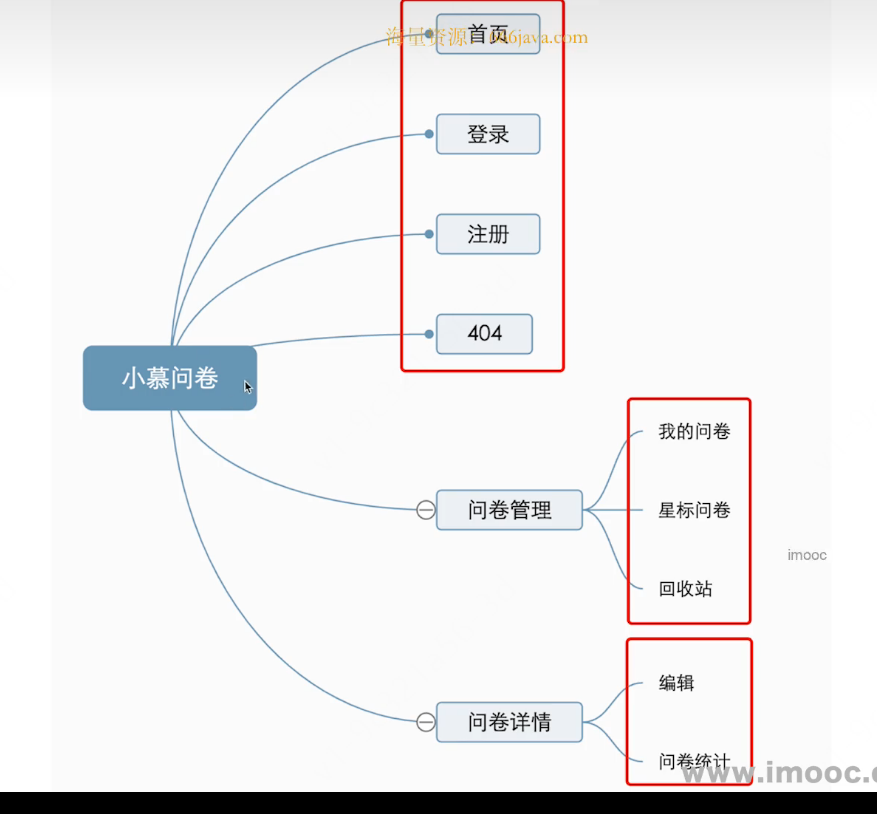
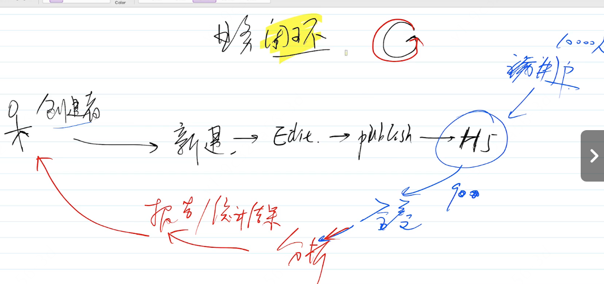
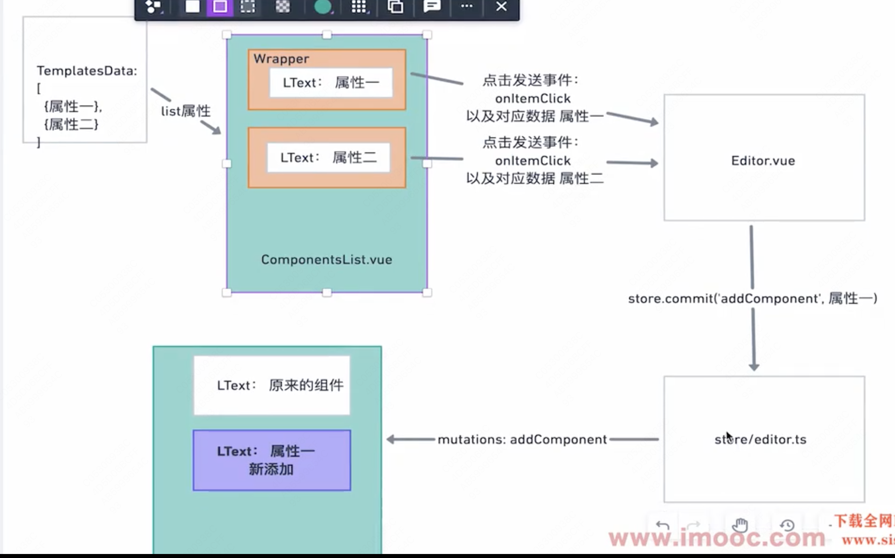
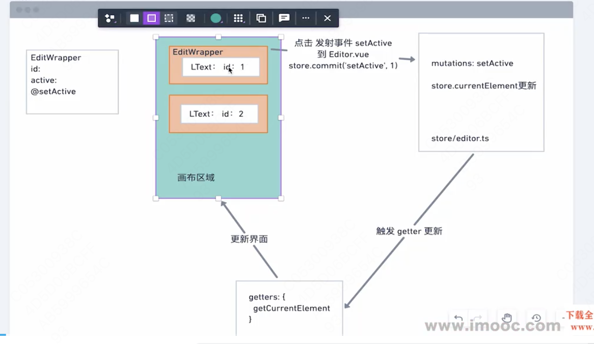
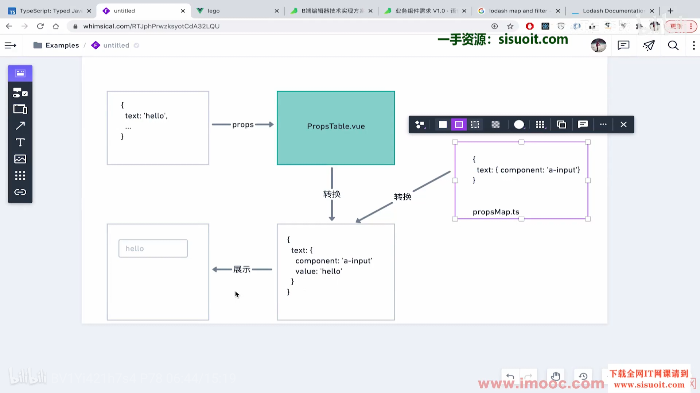
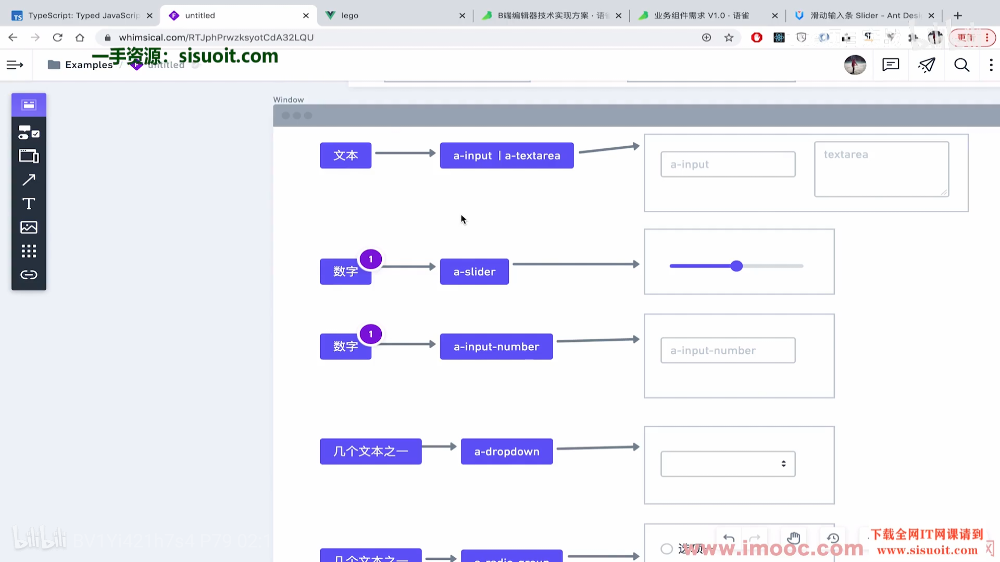

# 初始化项目

1. 创建项目(用vite来弄)
2. 接着加上eslint + prettier
3. 加上husky + commitlint / cz
4. 配置tailwindcss
5. 加路由

# 页面设计

路由设计

业务闭环


## 路由设计

# 组件的开发

1. 组件的通用的属性
2. 和单个组件的特有属性
3. 封装组件

# 业务开发


对于展示型组件的话事件不要和store做一个很强的绑定，最好由父组件来控制

## 左侧组件

解决方案:可以写死在本地，也可以从服务端获取。

### 点击左边组件添加到画布上

就是获取到点击这个组件的一些styleProps之后在store里面的组件中添加新的组件

## 获取画布上的组件的属性并且将它显示到右侧中

-   点击一个组件，选中
-   将它的属性以不同类型的表单呈现在右侧
-   编辑表单中的值，在值更新的同时将数据更新到页面中
    
    将属性和表单的组件进行映射
    

react技术解决方案（将属性映射到表单组件中）：

1. 给每一个组件添加一个修改属性的组件，之后获取这个组件。
2. 定义这个组件，

```js
import React, { FC, useEffect, useMemo } from 'react'
import { Form, Input } from 'antd'
import { LTextPropsType } from './interface'

const PropsComponent: FC<LTextPropsType> = (props) => {
    const { text } = props
    const [form] = Form.useForm()
    useEffect(() => {
        form.setFieldsValue({ text })
    }, [text])
    return (
        <Form form={form} layout="vertical" initialValues={{ text }}>
            <Form.Item
                label="标题内容"
                name="text"
                rules={[{ required: true, message: '请输入标题内容' }]}
            >
                <Input />
            </Form.Item>
        </Form>
    )
}

export default PropsComponent
```

3. 将这个组件展示出来还需要设计一个组件来展示相应的组件

```js
import React, { FC } from 'react'
import {
    ComponentConfType,
    getComponentConfByType,
} from '../../../../components'
import { LTextPropsType } from '../../../../components/LText'
import { useAppSelector } from '../../../../stores'
import { getCurrentElement } from '../../../../stores/editor'

const PropsTable: FC<LTextPropsType> = (prop) => {
    const currentElement = useAppSelector(getCurrentElement)
    const { props, name } = currentElement
    const { ChangePropComponent } = getComponentConfByType(
        name,
    ) as ComponentConfType

    return <ChangePropComponent {...props}></ChangePropComponent>
}
export default PropsTable

```

## 接着添加更多简单对应关系并且展示



## 修改属性，画布相应的发生改变

## 开发通用组件

-   TDD
-   上传组件
-   代码重构
-   组件源代码

### TDD开发

测试驱动开发

-   根据需求写测试用例
-   测试用例全部失败
-   开始写代码实现
-   将测试用例由失败变成通过

#### 开发ColorPicker组件

#### 上传组件

# 测试

## 测试工具

Jest 和 React Testing Library 进行单元测试

1. 单元测试
2. mock
3. TDD

## 测试框架的几大功能

断言
异步支持
Mock:
两种写法
代码覆盖率

## TDD

就是先写测试用例，再写代码

## jest测试框架

-   断言
-   异步测试，回调和Promise
-   mock函数-jest.fn()
-   mock第三方模块-jest.mock()
-   mock Timers - jest.useFakeTimers()

## jest testing library

-   渲染:render
-   获取元素
-   触发dom事件
-   异步请求
-   测试redux

# 开发通用组件

## 开发uploader

-   基本的上传功能
-   支持上传文件列表
    -   显示文件名称
    -   状态
    -   可删除
    -   显示上传进度
    -   有可能有更丰富的显示支持
-   自定义模板
    -   支持初始容器自定义
    -   支持上传完毕之后自定义
-   支持一系列的生命钩子
    -   beforeUpload
    -   onProgress
    -   onSuccess
    -   onError
    -   onChange
-   拖拽上传

# 后端

## 技术方案设计-接口设计

### 接口文档

#### 需求分析

功能拆分

1. 用户系统

-   注册：邮箱密码，手机验证码，Oauth2(gitee,github,微信)
-   登录:邮箱密码
-   创建用户POST /users/create
-   用户登录：POST /users/loginByEmail
-   手机验证码：POST /users/genVeriCode
-   手机验证码登录：POST /users/loginByPhoneNumber
-   Oath2：
-   跳转至 gitee GET /users/passport/gitee
-   跳转回到带着 access_token GET /users/passport/gitee/callback?access_token=\*\*\*
-   获取用户信息： GET /users/getUserInfo
-   修改用户信息：PATH /users/updateUserInfo
-   删除：DELETE /users/:id

2. 作品管理

-   创建空白作品 POST /works
-   复制作品 POST /works/copy/:id
-   获取我的作品或者模版列表 /works?title=\*\*\*&pageIndex=0&pageSize=4
-   获取单个作品 GET /works/:id
-   修改作品 PATCH /works/:id
-   删除作品 DELETE /works/:id
-   发布作品 POST /works/publish/:id
-   发布为模版 POST /works/publish-template/:id

3. 模板

-   发布作品 POST /works/publish/:id
-   发布为模版 POST /works/publish-template/:id

4. 渠道-依附于作品的特殊信息

-   创建渠道： POST channel/
-   获取一个作品的所有渠道：GET channel/getWorkChannels/2
-   更新渠道名称：PATCH channel/updateName/2
-   删除渠道：DELETE channel/2

5. 工具类

-   上传照片（本地上传、云服务上传以及图片处理）POST /utils/upload-img
-   展示H5页面
    使用 lego-components 使用 ssr 在 h5 端进行展示，这个接口不是标准 RESTful API， 用来展示页面，并且做样式转换和处理

-   GET /api/pages/:idAndUuid => nginx 改写至 h5.imooc-lego.com/p/:idAndUuid
-   GET /api/pages/preview/:idAndUuid 改写至 h5.imooc-lego.com/p/preview/:idAndUuid

6. 权限控制

-   第一层级：登录用户
-   第二层级：只能更新或者删除自己的资源
-   第三层级只能更新特定字段
-   第四层级：管理员

7. 统一返回格式

```js
{
    errno: 0, // 错误码，无错误则返回 0
    data: {...}, // 或者 [...]
    message: 'xxx'
}
```

8. 数据列表标准返回，上述统一格式 data 中的返回

```js
{
  total: 5, // 数据的总数
  list: [], //返回的数据
  pageIndex: 0, // 当前页数，从零开始
  pageSize: 5 // 每页的个数
}
```

### 调研后端技术选型

-   路由 Routes
-   请求 Request
-   响应 Response

#### express

##### 优点

快速，简单，易上手。

##### 缺点

-   路由响应中，很可能有：从外部请求数据的服务，有验证路由的请求参数，返回特定的格式。
-   所有逻辑不分青红皂白的写在一起，很容易产生冗长的难以维护的代码。
-   一些大型必备的模块，如第三方服务初始化，安全，日志都没有明确的标准。

###### express的中间件

```js
function myMiddleware(req, res, next) {
    next()
}
```

中间件可以完成的任务

-   执行任何代码。
-   对请求和响应对象进行更改。
-   结束请求/响应循环。
-   调用堆栈中的下一个中间件。

#### koa

#### egg

1. 支持ts
2. 有一套优秀的统一的约定或者架构开发
3. 有丰富的拓展机制和可定制性

#### nestjs

1. 支持ts
2. 和egg别的很相似

### 基本的上传功能

-   了解到了文件怎样上传的形式和ui界面的绘制

### 支持上传文件列表

-   将列表显示在界面上

### 支持自定义模块

-   使用了react里面的插槽

### 支持一系列的生命钩子

-   上传前检查: beforeUpload
-   上传中: onProgress：1. 使用axios的onUploadProgress 2.设计这些事件的参数
-   上传成功: onSuccess
-   上传失败: onError
-   上传改变: onChange

### 拖拽上传

-   dragover 和 dragleave 添加或者删除对应的class
-   drop事件拿到正在被拖拽的文件，删除class并触发上传
-   注意事件是可选的，只有在属性drag为true的时候才会生效

### 其他的功能

-   丰富上传数据 自定义headers
-   丰富上传数据 自定义file的表单名称
-   丰富上传数据 更多需要发送的数据
-   input的原生属性 multiple
-   input原生属性 accept
-   with-credentials 发送时是否支持发送cookies，默认为false

### 图片的预览

## 总结

vue3的三种实例

1. app instance通过createApp创建
2. component instance通过ref或者app.mount获取
3. component internal instance通过getCurrentInstance获取
   本地读取图片并且展示出来

-   URL.createObjectURL(file)
-   FileReader.readAsDataURL(file)
    HTMLImageElement家族继承
    HTMLImageElement -> HTMLELEMENT -> Element -> Node -> EventTarget
    TDD开发的好处

1. 对之前的功能更加有信心了，不会怕新功能破坏老功能
2. 重构更加方便了

# 业务组件库的打包

## js模块的发展历程

## 打包工具的作用

# 编辑器功能实现

## 裁剪图片的实现

使用Copper.js实现图片裁剪

根据阿里云的图片裁剪文档，实现图片裁剪功能

## 图层的实现

1. 点击按钮切换不同的值，使用这个值在页面上做判断
2. 点击选中，设置currentElement
3. 图层名称编辑：添加更多属性，点击图层名称的时候。

## 排序原理的s实现

1. 拖拽开始
2. 拖拽过程中
3. 拖拽结束
   //TODO：重要
   第一阶段
   使用 HTML 的 Drag 特性
   如果想可以拖拽 可以设置为 draggable = ‘true’
   使用 dragstart 事件监控拖动开始，并设置对应属性。
   第二阶段给被拖拽的元素添加一个状态
   使用dragStart事件来获取到当前拖拽的元素的索引，然后给拖动的元素添加样式
   第三阶段松开鼠标的时候将样式进行清除
   使用onDrop事件来清除样式，这个事件放在拖动区域上，因为默认网页上所有的放置的区域都是禁止的，要在dragOver事件上阻止默认事件
   第四个阶段drop的时候进行交换索引
   需要拿到拖拽元素的索引和释放元素的索引，然后交换两个元素的索引
   然后可以使用array-remove来进行数组元素的移动
   第四个阶段在交互过程中进行实时更新（进行交换索引）
   使用dragEnter事件来获取释放元素的索引，之后进行交换索引使用array-remove来进行数组元素的移动

### 排序

添加了react sortable hoc来实现拖拽功能

## 分组

创建组件EditGroup

## 复杂正则表达式的分析过程

https://regexr.com/

# 前端项目难点

-   拖拽移动图层的实现
-   拖拽改变图层大小的实现
-   复杂快捷键的实现
    -   Hotkeys.js
-   撤销和重做的实现
-   右键菜单的实现

## 拖拽图层的实现

## 拖拽改变图层大小的实现

## 复杂快捷键的实现

使用HotKey.js来实现

### 元素选中

1. 拷贝图层: 新建当前选择的元素的一个数据结构
2. 粘贴图层: 将新建的元素添加到components数组中
3. 删除图层: 在components数组中删除选择的元素
4. 取消选中: currentElement设置为空

### 元素移动

1. 上下左右移动一元素： 更新选中元素的props的top/left值
2. 上下左右移动 + 元素: 更新选中元素的props的top/left值

### 撤销/重做

1. 撤销
2. 重做

就是保存一个历史数据结构，对里面的数据进行操作

# 右键菜单

1. 点击右键弹出菜单
2. 生成菜单中有一系列操作
3. 点击对应的选项完成操作，并自定义菜单消失

实现：

1. 在中间编辑器区域拦截默认的右键点击事件
2. 判断是否点击在组件上
3. 显示一个自定义菜单，其中包括操作项，显示鼠标位置
4. 点击完成操作，重用快捷键已经支持的mutation,并且关闭自定义的菜单

# 前后端开发

## 前后端分离开发，以及分析接口的功能和需求

#### 开发流程

##### 定义规范

1. RESTful协议
2. 将其文档化
3. 让他版本化，每次升级之后，可以清楚查看变动
4. 使用工具: postman,swagger

##### 开发阶段

1. mock server
2. 并行开发

##### 联调

##### 提测

#### 后端接口需求

-   需要权限的才能访问(编辑器中的操作)
-   不需要权限才可以直接访问(获取热门海报)

## 使用AForm完成表单验证

## 应用通用状态的添加

-   全局loading
-   细粒化的Loading状态
-   全局错误处理

## 实现登陆过程以及登陆状态的持久化

## 路由权限验证

## 编辑器作品的操作

-   获取作品
-   保存作品
    -   点击保存
    -   自动保存
    -   未保存跳转

# 高阶函数的书写

1. 不管三七二十一嫌犯回一个函数和原来的函数处理一模一样的
2. 确定参数(要使用的参数)
3. 写内部重复的逻辑

## html2canvas实现截图上传功能

### 原理

目的：有一个canvas元素，上面有一系列的html节点
局限：Canvas上面无法添加具体的HTMl节点，他只是一个画布

解决方案：

1. 创建一个canvas元素
2. 创建svg文件，使用Blob构造函数
3. 将svg中的值填充foreignObject，然后填充想要复制节点的html
4. 创建image标签，将image.src = URL.createObjectURL(svg)
5. 调用canvas的drawImage方法，把图片会知道画布上

## 拷贝文本

方案一：
Clipboard API
方案二：
document.execCommand('copy')

## 图片下载原理

1. 创建一个a标签
2. 设置a标签的href属性
3. 设置a标签的download属性
4. 触发a标签的click事件

## 创建渠道

# 优化

## vite的打包优化

1. 文件太大，开启gzip压缩
2. 有必要的CDN
3. 分包处理
4. 优化结构(目录结构)
5. Tree Shaking Vite 在生产构建时默认启用 tree shaking，移除未使用的代码。
6. 图片优化 使用 vite-plugin-imagemin 插件压缩图片
7. 移除未使用的 CSS 使用 vite-plugin-purge-icons 插件、注释，console、
8. 按需加载组件库 对于 UI 组件库，使用相应的按需加载插件，如 unplugin-vue-components
9. 分析打包结果 使用 rollup-plugin-visualizer 插件分析打包结果，找出大文件
10. 设置 chunk 大小警告限制 在 Vite 配置中设置 chunk 大小警告限制
11. 拆分thunk
12. 延迟加载，动态加载

```ts
import { defineConfig } from 'vite'
import react from '@vitejs/plugin-react'
import removeConsole from 'vite-plugin-remove-console'
import { visualizer } from 'rollup-plugin-visualizer'
import PurgeIcons from 'vite-plugin-purge-icons'
import viteCompression from 'vite-plugin-compression'

// https://vitejs.dev/config/
export default defineConfig({
    base: '/',
    plugins: [
        react(),
        //删除console
        removeConsole({
            includes: ['log'],
        }),
        //分析哪些文件比较大,会有一个图片来分析哪个文件大
        visualizer({
            open: true,
            gzipSize: true,
            brotliSize: true,
        }),
        //移除未使用的css
        PurgeIcons(),
        //压缩图片
        viteCompression({
            verbose: true, // 是否在控制台中输出压缩结果
            disable: false,
            threshold: 1024 * 500, // 如果体积大于阈值，将被压缩，单位为b，体积过小时请不要压缩，以免适得其反
            algorithm: 'gzip', // 压缩算法，可选['gzip'，' brotliccompress '，'deflate '，'deflateRaw']
            ext: '.gz',
            deleteOriginFile: true, // 源文件压缩后是否删除(我为了看压缩后的效果，先选择了true)
        }),
    ],
    build: {
        terserOptions: {
            format: {
                comments: false,
            },
        },
        chunkSizeWarningLimit: 500, // 单位kb
        //拆分thunk
        rollupOptions: {
            output: {
                chunkFileNames: 'js/[name]-[hash].js', // 引入文件名的名称
                entryFileNames: 'js/[name]-[hash].js', // 包的入口文件名称
                assetFileNames: '[ext]/[name]-[hash].[ext]', // 资源文件像 字体，图片等
                manualChunks: {
                    react: [
                        'react',
                        'react-dom',
                        'redux',
                        'react-router-dom',
                        'react-redux',
                    ],
                    lodash: ['lodash-es'],
                    antd: ['antd'],
                    html2canvas: ['html2canvas'],
                    cropper: ['cropperjs'],
                },
            },
        },
    },
})
```

## http缓存

# 最后的部署

## 开发环境、测试环境、生产环境

开发环境

-   会添加丰富的错误提示
-   可以使用mock-server或者本地后端服务器模拟数据
-   hot reload
-   不太关心静态资源的大小，最好提供丰富的调试信息（sourcemap）

生产环境

-   稳定
-   速度

测试环境

-   高度相似的生产环境
-   后端服务不一样
